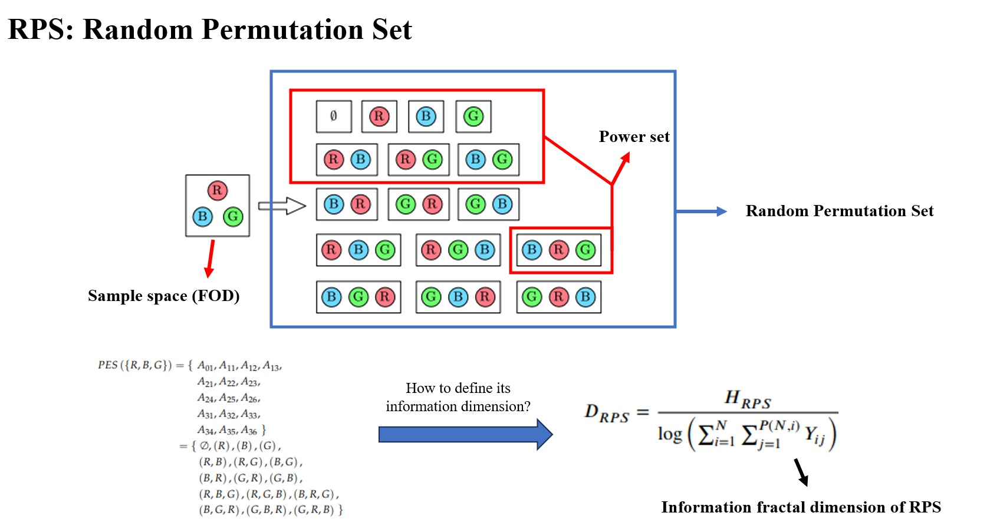
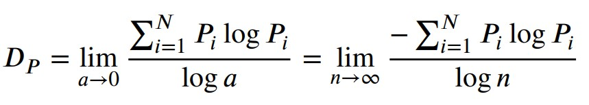

Highlights
=====
- The information dimension of a specific permutation mass function in RPS is defined.
- Some properties of the dimension are presented.
- The information dimensions of several distribution modes are calculated.
- The information dimension corresponding to the maximum RPS entropy is 2.

What is RPS?
=====
Given a set &Theta;, we know that its power set considers all combinations of elements in &Theta;. How about if we consider all permutations of elements in &Theta;?

<a href="https://www.univagora.ro/jour/index.php/ijccc/article/view/4542">Random Permutation Set (RPS)</a> consists of permutation event space (PES) and permutation mass function (PMF). The PES of a certain set &Theta; considers all the permutations of &Theta;. The elements of PES are named as the permutation events. PMF describes the chance of a certain permutation event that would happen. Based on PES and PMF, RPS can be viewed as a permutation-based generalization of a random finite set.

What is fractal dimension?
=====

In mathematics, a <a href="https://en.wikipedia.org/wiki/Fractal">fractal</a> is a geometric shape containing detailed structure at arbitrarily small scales, usually having a fractal dimension strictly exceeding the topological dimension. Many fractals appear similar at various scales, as you can see in the Sierpinski triangle:

 

In our understanding, a straight line is one-dimensional, while a plane is two-dimensional. So what is the dimension of the Sierpinski triangle mentioned above? This seems odd because it obviously has a higher dimension than a line, yet it does not fill the entire plane. Defining its dimension requires introducing fractal dimension, such as <a href="https://en.wikipedia.org/wiki/Hausdorff_dimension">Hausdorff dimension</a> and <a href="https://en.wikipedia.org/wiki/Minkowski%E2%80%93Bouligand_dimension">Minkowski–Bouligand dimension</a>. By calculation, we can find that the dimension of the Sierpinski triangle is ln3/ln2, which falls between one dimension and two dimensions. Pretty intriguing, isn't it?

Information dimension of RPS
=====

<a href="https://link.springer.com/article/10.1007/BF02063299">Information dimension</a> belongs to the family of fractal dimensions, which can be used to describe the behavior of chaotic attractors and holds significant importance in analysis of probability distributions. Given a probability distribution, its information dimension can be calculated as below:

So here's the question: for a RPS, or for a PMF, how do we define its corresponding information dimension? In order to address this issue, we propose the information fractal dimension of RPS, and find the information dimension corresponding to the maximum RPS entropy is 2, which is equivalent to the fractal dimension of <a href="https://en.wikipedia.org/wiki/Brownian_motion">Brownian motion</a> and <a href="https://en.wikipedia.org/wiki/Peano_curve">Peano curve</a>.

     

For more details, please refer to the <a href="../files/Selected_Pub_Dimension.pdf">paper</a>. 

     
